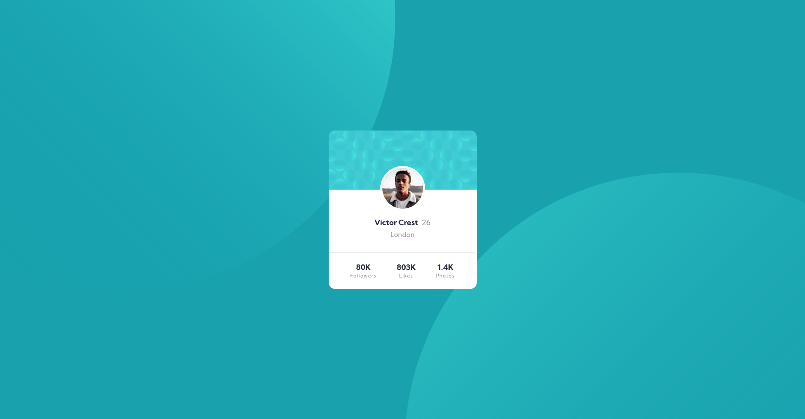

# Frontend Mentor - Profile card component solution

This is a solution to the [Profile card component challenge on Frontend Mentor](https://www.frontendmentor.io/challenges/profile-card-component-cfArpWshJ). Frontend Mentor challenges help you improve your coding skills by building realistic projects.

## Table of contents

- [Overview](#overview)
  - [The challenge](#the-challenge)
  - [Screenshot](#screenshot)
  - [Links](#links)
- [My process](#my-process)
  - [Built with](#built-with)
  - [What I learned](#what-i-learned)
  - [Continued development](#continued-development)
- [Author](#author)

## Overview

### The challenge

- Build out the project to the designs provided

### Screenshot



### Links

- Solution URL: [Add solution URL here](https://github.com/WidePeepoHappy/profile-card-component.git)
- Live Site URL: [Add live site URL here](https://widepeepohappy.github.io/profile-card-component/)

## My process

### Built with

- Semantic HTML5 markup
- Flexbox
- SASS
- BEM

### What I learned

Learned how to use position absolute, to center an image between two blocks:

```scss
&__header {
  background-image: url(/images/bg-pattern-card.svg);
  position: relative;
  height: 140px;
  img {
    position: absolute;
    top: 60%;
    left: 35%;
    border: 5px solid white;
    border-radius: 50%;
  }
}
```

### Continued development

Couldn't figure out how to style background images responsively. Need to work on that.

## Author

- Frontend Mentor - [@WidePeepoHappy](https://www.frontendmentor.io/profile/WidePeepoHappy)
